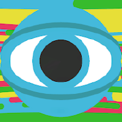

### Hiya

I'm Roman Garms, a Computer Science major going to University of California Santa Cruz. I'm interested in computers, cars, videography, as well as trying to get tech to do something it's never done before. Big fan of porting Doom to things it never should run on.

```
Familiar with:
- Python
- Java
- Javascript
- C#
- C
- Swift
```

```
My favorite projects:
- Making my Spotify Now Playing web app designed for a Raspberry Pi
- Creating a Teenage Engineering OP-1 Tombola themed music utility for the OP-Z synthesizer
- Creating custom applications to run on my car's infotainment system
- Creating a Forza-Horizon-like location tracker website that shows me all of the roads I've driven
- Porting a friend's game to the Playstation 3
- Tuning my car with a Steam Deck
- Running Doom on a drone controller
```
#### Organizations I'm Involved In (Past or Present)
[](https://github.com/Videolab-Creators-Group)
[](https://github.com/CNSeattle)

## Check out my website!
### [romangarms.com](https://romangarms.com)
